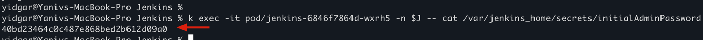
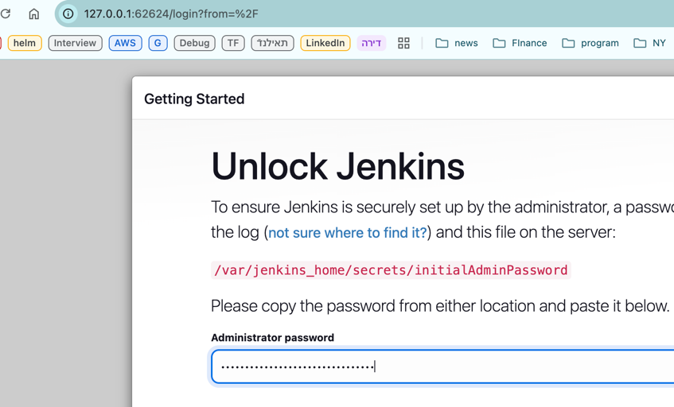
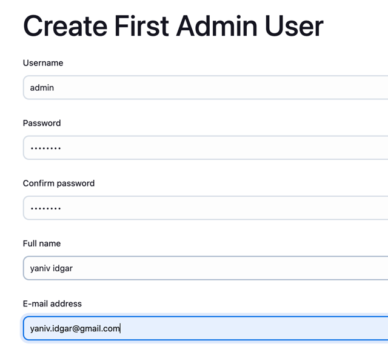
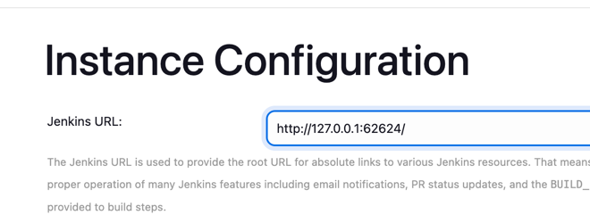
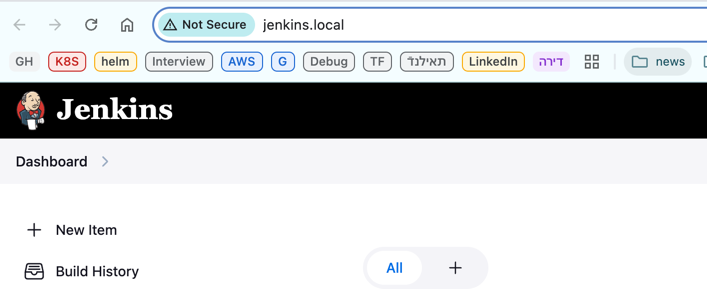

# preparations
## define aliases 
```shell
alias k="kubectl"
export NS="devops-tools|"
```
## build the jenkins image with docker 
(to be used in the jenkins-deployment.yaml)
```shell
docker build -t yidgar11/jenkins_lts_with_docker:1.0 .
```

# Install Jenkins 
```shell
cd Jenkins
k apply -f jenkins-namespace.yaml
k apply -f jenkins-service-account.yaml
k apply -f jenkins-volume.yaml
k apply -f jenkins-deployment.yaml
k apply -f jenkins-service.yaml
k apply -f jenkins-ingress-class.yaml
k apply -f jenkins-ingress.yaml
```


## get the initial password  (change afterwards)
```shell
kubectl exec -it ${JENKINS_POD} -n $J -- cat /var/jenkins_home/secrets/initialAdminPassword -n devops-tools
```


## Post installation setup

```shell
minikube service jenkins-service
```
And insert the password 


And install suggested plugins 

## Create first admin user


Get the jenkins URL 


# jenkins ingress 
1. add jenkins.local to /etc/hosts
2. run minikube tunnel 
```shell
sudo minikube tunnel
```
3. login to jenkins using jenkins.local
