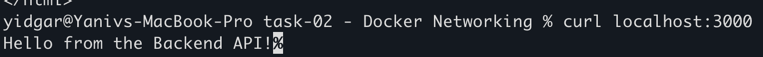

# how to build and run 

# 1. Create network
docker network create app-network

## 2. Navigate to the 'backend' directory and build the image 
cd backend && docker build -t my-backend-api:1.0 . && cd ../

## 3. Navigate to the 'web' directory and Build the image
cd web && docker build -t my-web-server:1.0 . && cd ../

# 4. Run the images in the docker network 
# 4.1 Pull and run MongoDB container
docker run -d --name database-container --network app-network -p 27017:27017 mongo:5.0

- MongoDB will be accessible at `localhost:27017`

## 4.2 Run the backend container  
docker run -d --name backend-container --network app-network -p 3000:3000 \
  --env DATABASE_HOST=database-container \
  --env DATABASE_PORT=27017 my-backend-api:1.0

## 4.3 Run the web-server container
docker run -d --name web-container --network app-network -p 8080:80 my-web-server:1.0

# check the containers 
	•	Access the web server `curl http://localhost:8080`.

	•	Access the backend API :  `curl http://localhost:3000`.

# check that all containers run in the network 
docker inspect network app-network

# check ping between the containers
## backend-container to database-container
docker exec -it backend-container ping database-container

## web-container to backend-container
docker exec -it web-container ping backend-container

## web to Database 
docker exec -it web-container ping database-container
