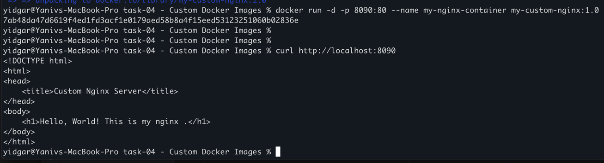

# 1. Build the docker image
docker build -t my-custom-nginx:1.0 .

# 2. Run the container 
docker run -d -p 8090:80 --name my-nginx-container my-custom-nginx:1.0

# 3. verify it return the index file on localhost:8090

