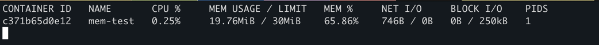
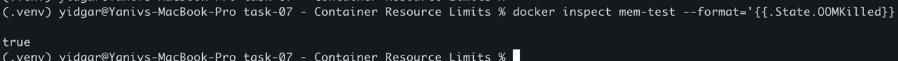

# Build docker image 
docker build -t memory-test:1.0 .

# 2. Run the docker image (After 30 seconds will be out of memory)
docker run -it --memory=30m --name mem-test memory-test:1.0

# 3. observe container using:
docker stats mem-test

after reacing 

# Another option for inspection :  
docker inspect mem-test --format='{{.State.OOMKilled}}'
