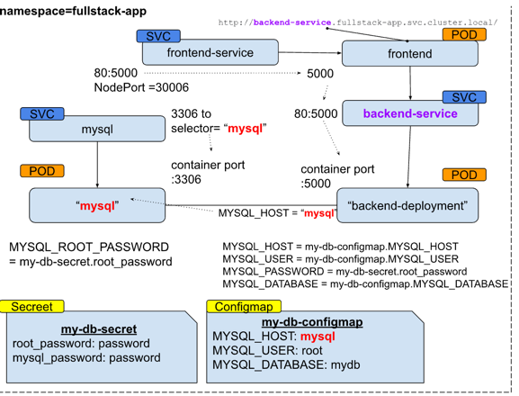
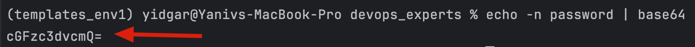
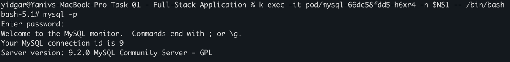
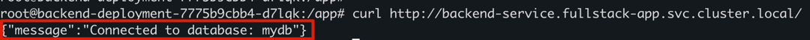
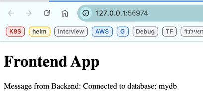
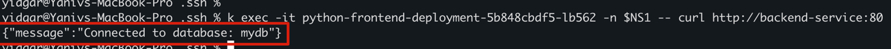

# preparations 
```sh
alias k="kubectl"
export NS1="fullstack-app"
```

# Creation of all resources
```sh
k apply -f namespace/resource-quota.yaml
k apply -f secrets/secret-02.yaml
k apply -f configuration/configmap-02.yaml
k apply -f configuration/external-name-service.yaml
k apply -f storage/mysql-storage.yaml
k apply -f services/mysql-deployment.yaml
k apply -f services/backend-deployment.yaml
k apply -f frontend/frontend-deployment.yaml
```

# Deletion of all resources
```sh
k delete -f namespace/resource-quota.yaml
k delete -f secrets/secret-02.yaml
k delete -f configuration/configmap-02.yaml
k delete -f configuration/external-name-service.yaml
k delete -f storage/mysql-storage.yaml
k delete -f services/mysql-deployment.yaml
k delete -f services/backend-deployment.yaml
k delete -f frontend/frontend-deployment.yaml
```

# Description 



## Detailed Steps 
### 1. Create a namespace called `fullstack-app` to isolate the resources.
```sh
k create ns fullstack-app
```

### 2. Set a resource quota for the namespace to limit resource usage.
```sh
k apply -f namespace/resource-quota.yaml
```

Note: When creating resource quota , need to define resources (request and limit) in the deployments  

### 3. Deploy a MySQL Database
Create a Secret for the MySQL root password and a ConfigMap for database configuration.

#### 3.1 Create a Secret for the MySQL root password.

decode mypassword and add to the secret file 

```sh
echo -n password | base64
```



#### 3.2 Create a ConfigMap for MySQL database configuration.

#### 3.3 Deploy MySQL with the created Secret and ConfigMap.
```sh
k apply -f secrets/secret-02.yaml
k apply -f configuration/configmap-02.yaml
k apply -f services/mysql-deployment.yaml
```

#### 3.4 Check db is working and craete the database mydb

```sh
k exec -it pod/mysql-66dc58fdd5-h6xr4 -n $NS1 -- /bin/bash
```

and create the mydb database: 

```sh
mysql -p   (password = 'password')
create database mydb;
use mydb;
show databases;
```

#### 3.5 Create the Backend image 
```sh
docker login -u yidgar11
docker build -t yidgar11/my-backend:1.0
docker push yidgar11/my-backend:1.0
```

### 4. Use it in the Backend-deployment.yaml and apply

```sh
k apply -f services/backend-deployment.yaml
```

#### 4.1 check if backend can connect to DB , connec to to backend pod 

```sh
k exec -it pod/backend-deployment-7775b9cbb4-d7lqk -n $NS1 -- /bin/bash
```

#### 4.2 install curl using:
```sh
apt-get update && apt-get install curl
``` 

and check 

```sh
curl http://backend-service.fullstack-app.svc.cluster.local/
```


### 5. Deploy frontend service

```sh
k apply -f frontend/frontend-deployment.yaml
```

### 6. Configure Services
Already added "service" section in the deployment of 
- MySql deployment 
- Fronend deployment
- Backend deployment

### 7. Create a ConfigMap for the backend server configuration.
### 8. Create a Secret for storing API keys used by the backend server.
 section 7,8 were already done and deployed before the deployment of mysql,FE and BE 

### 9. Testing the Setup
#### 9.1 Check the Frontend Service:
```sh
minikube service python-frontend-service -n $NS1
```



#### 9.2 Access the Backend Service from the Frontend Pod
```sh
k exec -it python-frontend-deployment-5b848cbdf5-lb562 -n $NS1 -- curl http://backend-service:80
```



#### 9.3 Verify Database Connection from the Backend Pod:


Still problem - now working for some reason 
k exec -it backend-deployment-7775b9cbb4-2wc4q -n $NS1 -- curl http://mysql:3306
curl: (1) Received HTTP/0.9 when not allowed
