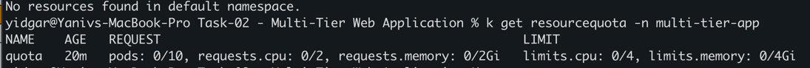
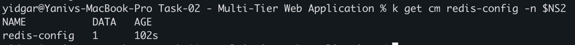
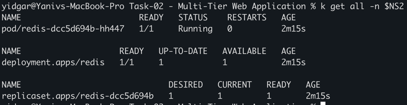
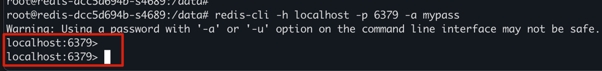
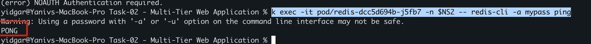
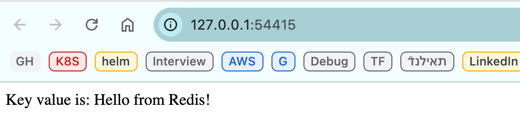
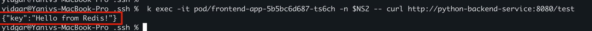
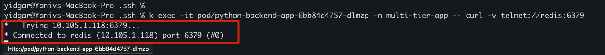

# preparations
```sh
alias k="kubectl"
export NS2="multi-tier-app"
```

## Steps 
### 1. Create a namespace called `multi-tier-app` to isolate the resources.

```sh
k cretae ns multi-tier-app
```

### 2. Set a resource quota for the namespace to limit resource usage.
```sh
k apply -f namespace/resource-quota.yaml
```


### 3. Deploy a Redis Cache
#### 3.1 Create a ConfigMap for Redis configuration.
```sh
k apply -f configuration/configmap-redis.yaml
```


Deploy Redis with the created ConfigMap.
```sh
k apply -f deployments/redis-deployment.yaml
```


#### login to the pod to check redis is working
```sh
exec -it pod/redis-dcc5d694b-zsfqx -n $NS2 -- /bin/bash
# and run 
redis-cli -h localhost -p 6379 -a mypass
```


also using
```sh
k exec -it pod/redis-dcc5d694b-j5fb7 -n $NS2 -- redis-cli -a mypass ping
```
and expect to get PONG



### 4. Deploy a Backend Server
#### Deploy the backend server with environment variables configured to connect to the Redis cache.
```sh
k apply -f deployments/backend-deployment.yaml
```
#### Ensure the backend server has two replicas.
(v)

### 5. Deploy a Frontend Server
#### Deploy the frontend server with environment variables configured to connect to the backend server.
```sh
k apply -f deployments/frontend-deployment.yaml
```

#### Ensure the frontend server has two replicas.
(v) 

### 6. Configure Services 
All below configs , were create in the deployment file of each one : 
- Create a ClusterIP service for the Redis cache.
- Create a ClusterIP service for the backend server.
- Create a NodePort service for the frontend server.
### 6.1 external name 
- Create an ExternalName service to map an external DNS name.
```sh
k apply -f configuration/external-name-service.yaml
```

### 7. Use ConfigMaps for Configuration
Create a ConfigMap for the backend server configuration.
(v)

### 8. Use Secrets for Sensitive Data
Create a Secret for storing sensitive information used by the backend server.
 
- Created secrets for redis password and used in the backend for connection
- I had some issue - not sure how to add the redis password using a secret , since it is in dat configmap data 

## Testing the Setup
Once everything is deployed, you can test the setup using `curl` commands.
### 1. **Check the Frontend Service:**
```sh
minikube service python-backend-service -n $NS2
```


### 2. **Access the Backend Service from the Frontend Pod:**
```sh
k exec -it pod/frontend-app-5b5bc6d687-ts6ch -n $NS2 -- curl http://python-backend-service:8080/test
```


```sh
minikube service frontend-service -n $NS2
```
TBD , does not work properly 

### 3. **Verify Cache Connection from the Backend Pod:**
```sh
k exec -it pod/python-backend-app-6bb84d4757-dlmzp -n multi-tier-app -- curl http://redis:6379
```
i got : curl: (52) Empty reply from server

However , using below commands, it does work 
```sh
k exec -it pod/python-backend-app-6bb84d4757-dlmzp -n multi-tier-app -- curl -v telnet://redis:6379
```


