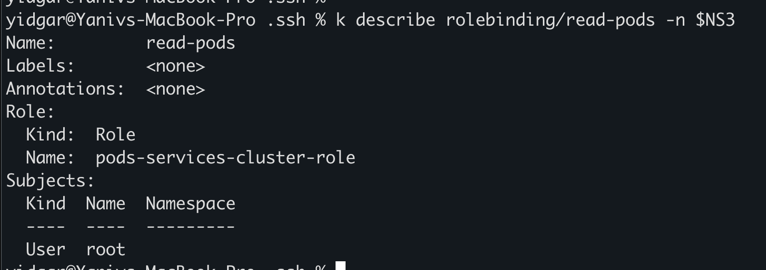
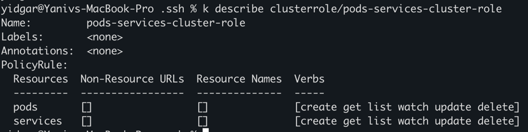
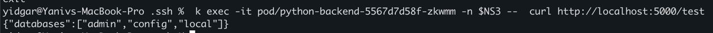

# preparations 
`alias k="kubectl"`

`export NS3="secure-app"`

`k create ns $NS3`


# Creation of all resources
`k apply -f namespace/resource-quota.yaml`

`k apply -f secrets/secret-02.yaml`

`k apply -f configuration/configmap-02.yaml`

`k apply -f configuration/external-name-service.yaml`

`k apply -f storage/mysql-storage.yaml`

`k apply -f services/mysql-deployment.yaml`

`k apply -f services/backend-deployment.yaml`

`k apply -f frontend/frontend-deployment.yaml`

# Deletion of all resources

`k delete -f namespace/resource-quota.yaml`

`k delete -f secrets/secret-02.yaml`

`k delete -f configuration/configmap-02.yaml`

`k delete -f configuration/external-name-service.yaml`

`k delete -f storage/mysql-storage.yaml`

`k delete -f services/mysql-deployment.yaml`

`k delete -f services/backend-deployment.yaml`

`k delete -f frontend/frontend-deployment.yaml`


# Description 
-- Add here Drawing 

## Detailed Steps 
### 1. Create a namespace called `secure-app` to isolate the resources.

### 2. Set a resource quota for the namespace to limit resource usage.
`k apply -f namespace/resource-quota.yaml`

### 3. Set Up RBAC Permissions
Create Role and RoleBinding to manage permissions within the namespace.
#### Create a Role that grants permissions to manage pods and services.
`k apply -f rbac/role.yaml`


####  Create a RoleBinding that assigns the Role to a specific user.
`k apply -f rbac/role-binding.yaml`



### 4. Deploy a MongoDB Database
Create a Secret for the MongoDB credentials and a ConfigMap for database configuration.
#### Create a Secret for MongoDB credentials.
`k apply -f secrets/mongodb-secret.yaml`

#### Create a ConfigMap for MongoDB configuration.
`k apply -f configuration/mongodb-cm.yaml`

#### Deploy MongoDB with the created Secret and ConfigMap.
`k apply -f deployments/mongodb-deployment.yaml`

### 5. Deploy a Backend Server
#### 5.1 Deploy the backend server with environment variables configured to connect to the MongoDB database.
`k apply -f deployments/mongodb-backend.yaml`

#### 5.2 Ensure the backend server has three replicas.
(v)
#### 5.3 Include readiness and liveness probes for health checks.
(v)

##### Check the backend deployment app (/test return the databases list)
` k exec -it pod/python-backend-5567d7d58f-zkwmm -n $NS3 --  curl http://localhost:5000/test`



### 6. Deploy a Frontend Server
#### Deploy the frontend server with environment variables configured to connect to the backend server.
#### Ensure the frontend server has three replicas.
#### Include readiness and liveness probes for health checks.

### 7. Configure Services
#### Create a ClusterIP service for the MongoDB database.
Already done in the deployment 
#### Create a ClusterIP service for the backend server.
(x) Already done in the deployment 
#### Create a NodePort service for the frontend server.
(x) Already done in the deployment 
#### Create an ExternalName service to map an external DNS name.

### 8. Use ConfigMaps for Configuration
Create a ConfigMap for the backend server configuration.

applied before the deployment of deploymets yaml 

`k apply -f configuration/mongodb-cm.yaml`

### 9. Use Secrets for Sensitive Data
Create a Secret for storing API keys used by the backend server.

applied before the deployment of deploymets yaml

`k apply -f secrets/mongodb-secret.yaml`

### 10. Perform Health Checks on Replicas
Add liveness and readiness probes to the backend and frontend deployments to perform health checks.

## Testing the Setup
Once everything is deployed, you can test the setup using `curl` commands.
### 1. **Check the Frontend Service:**
```sh
curl http://<minikube-ip>:30003
```
### 2. **Access the Backend Service from the Frontend Pod:**
```sh
kubectl exec -it <frontend-pod> -n secure-app -- curl http://backend:8080
```
### 3. **Verify Database Connection from the Backend Pod:**
```sh
kubectl exec -it <backend-pod> -n secure-app -- curl http://mongodb:27017
```