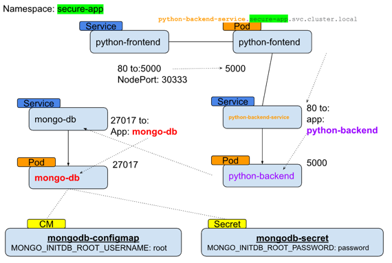

# preparations 
```sh
alias k="kubectl"
export NS3="secure-app"
k create ns $NS3
````

# Creation of all resources
## configurations etc'
```sh
k apply -f rbac/role.yaml
k apply -f rbac/role-binding.yaml
k apply -f storage/pvc.yaml
k apply -f secrets/mongodb-secret.yaml
k apply -f configuration/mongodb-cm.yaml
k apply -f configuration/external-name-service.yaml`
```
`
## Deploments etc'
```sh
k apply -f deployments/mongodb-deployment.yaml
k apply -f deployments/mongodb-backend.yaml
k apply -f deployments/mongodb-frontend.yaml
```

# Deletion of all resources
## Deplyments etc'
```sh
k delete -f deployments/mongodb-deployment.yaml
k delete -f deployments/mongodb-backend.yaml
k delete -f deployments/mongodb-frontend.yaml
```

## configurations etc'
```sh
k delete -f rbac/role.yaml
k delete -f rbac/role-binding.yaml
k delete -f storage/pvc.yaml
k delete -f secrets/mongodb-secret.yaml
k delete -f configuration/mongodb-cm.yaml
k delete -f configuration/external-name-service.yaml
````

# Description 


## Detailed Steps 
### 1. Create a namespace called `secure-app` to isolate the resources.

### 2. Set a resource quota for the namespace to limit resource usage.
```sh
k apply -f namespace/resource-quota.yaml
```

### 3. Set Up RBAC Permissions
Create Role and RoleBinding to manage permissions within the namespace.
#### Create a Role that grants permissions to manage pods and services.
```sh
k apply -f rbac/role.yaml
````


####  Create a RoleBinding that assigns the Role to a specific user.
`k apply -f rbac/role-binding.yaml`


### 4. Deploy a MongoDB Database
Create a Secret for the MongoDB credentials and a ConfigMap for database configuration.
#### Create a Secret for MongoDB credentials.
```sh
k apply -f secrets/mongodb-secret.yaml
```

#### Create a ConfigMap for MongoDB configuration.
```sh
k apply -f configuration/mongodb-cm.yaml
```

#### Deploy MongoDB with the created Secret and ConfigMap.
`k apply -f deployments/mongodb-deployment.yaml`

### 5. Deploy a Backend Server
#### 5.1 Deploy the backend server with environment variables configured to connect to the MongoDB database.
`k apply -f deployments/mongodb-backend.yaml`

#### 5.2 Ensure the backend server has three replicas.
(v)
#### 5.3 Include readiness and liveness probes for health checks.
(v)

##### Check the Backend deployment app (/test return the databases list)
```sh
k exec -it pod/python-backend-5567d7d58f-zkwmm -n $NS3 --  curl http://localhost:5000/test
```


```sh
k port-forward pod/python-backend-5567d7d58f-vtshb -n $NS3 5000:5000`
# and from other tab: 
curl localhost:5000/test
```


##### and from the service


### 6. Deploy a Frontend Server
#### Deploy the frontend server with environment variables configured to connect to the backend server.
```sh
k apply -f deployments/mongodb-frontend.yaml
```
#### Ensure the frontend server has three replicas.
(v)
#### Include readiness and liveness probes for health checks.
```sh
k apply -f configuration/external-name-service.yaml
```

#### Check the pod behavior 
```sh
k port-forward pod/python-frontend-7bbd6c8f7d-4s6ts -n $NS3 5000:5000
curl localhost:5000/
```


also check same behavior through the service port-forward,
Expect same result 
```sh
k port-forward service/python-frontend-service -n $NS3 5000:80
curl localhost:5000/
```

### 7. Configure Services
#### Create a ClusterIP service for the MongoDB database.
Already done in the deployment 
#### Create a ClusterIP service for the backend server.
Already done in the deployment 
#### Create a NodePort service for the frontend server.
Already done in the deployment 
#### Create an ExternalName service to map an external DNS name.

### 8. Use ConfigMaps for Configuration
Create a ConfigMap for the backend server configuration.

(v) applied before the deployment of deploymets yaml 

```sh
k apply -f configuration/mongodb-cm.yaml
```

### 9. Use Secrets for Sensitive Data
Create a Secret for storing API keys used by the backend server.

(V) applied before the deployment of deployments yaml

```sh
k apply -f secrets/mongodb-secret.yaml
```

### 10. Perform Health Checks on Replicas
Add liveness and readiness probes to the backend and frontend deployments to perform health checks.
(v) 

## Testing the Setup
Once everything is deployed, you can test the setup using `curl` commands.
### 1. **Check the Frontend Service:**
```sh
curl http://<minikube-ip>:30003
```
I have used below: 
```sh
minikube service python-frontend-service -n $NS3
```


### 2. **Access the Backend Service from the Frontend Pod:**
```sh
# kubectl exec -it <frontend-pod> -n secure-app -- curl http://backend:8080
k exec -it pod/python-frontend-659b74456-hwm4b -n $NS3 -- curl http://python-backend-service:80
```


### 3. **Verify Database Connection from the Backend Pod:**
```sh
# kubectl exec -it <backend-pod> -n secure-app -- curl http://mongodb:27017

kubectl exec -it pod/python-backend-5567d7d58f-vtshb -n secure-app -- curl http://mongo-db:27017
```

