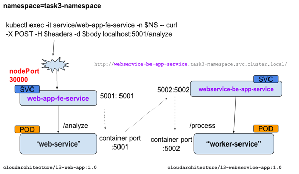
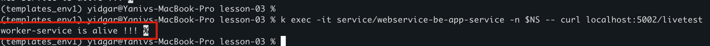

# preparations 
```sh
alias k="kubectl"
export NS="task3-namespace"
export headers="Content-Type: application/json"
export body='{"text": "This is a test task"}'
```
## Create PRIVATE repository in AWS for the 2 apps 
```shell
aws ecr create-repository --region us-east-1 --repository-name cloudarchitecture/l3-webservice-frontend
aws ecr create-repository --region us-east-1 --repository-name cloudarchitecture/l3-worker-service-backend 
```
- 
# Description



## Build the apps 
1. Login to ECR
```shell 
aws ecr get-login-password --region us-east-1 | docker login --username AWS --password-stdin {account_id}.dkr.ecr.us-east-1.amazonaws.com
``` 

2. Build the docker image  
cd to the relevant directory
```shell
# Frontend (port 5001)
cd web-service-fornend/
docker build -t {AWS_ID}.dkr.ecr.us-east-1.amazonaws.com/cloudarchitecture/l3-web-app:1.0 .

# Backend (port 5002)
cd worker-service/
docker build -t {AWS_ID}.dkr.ecr.us-east-1.amazonaws.com/cloudarchitecture/l3-webservice-app:1.0 .
```

3. Push the image
```shell
docker push {account_id}.dkr.ecr.us-east-1.amazonaws.com/cloudarchitecture/{image_name}:1.0
```

4. Create Secret for pulling the image from ECR 
   and Reference this secret in your Kubernetes deployment configuration
   
    `secret name : lesson3-secret` 
```shell
kubectl create secret docker-registry <secret-name> \
  --docker-server=<aws_account_id>.dkr.ecr.<region>.amazonaws.com \
  --docker-username=AWS \
  --docker-password=$(aws ecr get-login-password --region <region>) \
  -n $NS
```
5. To (manually) pull an image from ECR , use :
```shell
docker pull {AWS_ACCOUNT_ID}.dkr.ecr.{REGION}.amazonaws.com/{repository}/{image_name}:{TAG}
```

# Creation of all resources
```shell
k apply -f configuration/task3-namespace.yaml
k apply -f deployments/deployment-webapp.yaml
k apply -f deployments/deployment-webservice.yaml
```

# Deletion of all resources
```shell
k delete -f deployments/deployment-webapp.yaml
k delete -f deployments/deployment-webservice.yaml
k delete -f configuration/task3-namespace.yaml
```

# Basic checks - after deployment
1. check the web-app-fe pod 
```shell
k exec -it pod/web-app-fe-6bd5f868f7-6695f -n $NS -- curl localhost:5001/livetest
```


2. check the webserver-be pod 
```shell
k exec -it pod/webservice-be-app-6b89df64ff-5qbhw -n $NS -- curl localhost:5002/livetest
```


3. check the web-app-fe service 
```shell
k exec -it service/web-app-fe-service -n $NS -- curl localhost:5001/livetest
```


4. check the webserver-be pod
```shell
k exec -it service/webservice-be-app-service -n $NS -- curl localhost:5002/livetest
```


# Flow of Communication
1. A user sends a request to the NodePort service (`web-service`).
2. `web-service` forwards the request to the ClusterIP service (`worker-service`).
3. `worker-service` processes the request and responds.
4. `web-service` sends the processed response back to the user.


# Check using
```shell
k exec -it service/web-app-fe-service -n $NS -- curl -X POST -H $headers -d $body localhost:5001/analyze
```
 