# preparations 
```sh
alias k="kubectl"
export NS="flask-app"
export region="us-east-1"
export AWS_ID=148761662110
```
## Login to ECR
```shell 
# For PRIVATE
aws ecr get-login-password --region ${region} | docker login --username AWS --password-stdin ${AWS_ID}.dkr.ecr.${region}.amazonaws.com

# For PUBLIC 
aws ecr-public get-login-password --region ${region} | docker login --username AWS --password-stdin public.ecr.aws/q2y0f5j6
``` 

## Create PRIVATE OR PUBLIC repository in AWS for the flask-app
```shell
# For PRIVATE
aws ecr create-repository --region ${region} --repository-name cloudexperts_yidgar/falsk-app

# FOr PUBLIC 
aws ecr-public create-repository --repository-name cloudexperts_yidgar/flask-app
 
```

# create nginx ingress 
```shell
k create ns ingress-nginx
k apply -f https://raw.githubusercontent.com/kubernetes/ingress-nginx/main/deploy/static/provider/cloud/deploy.yaml
```

# Description
### Flask-app 
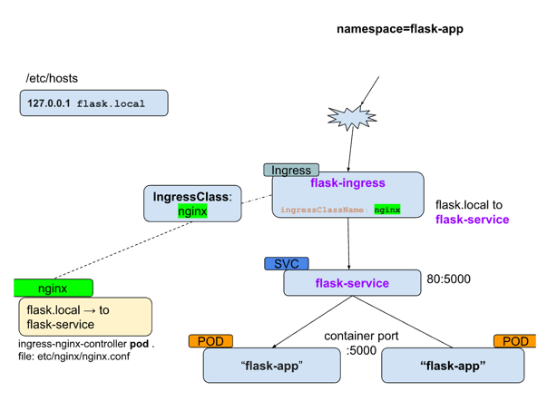

### Volumes
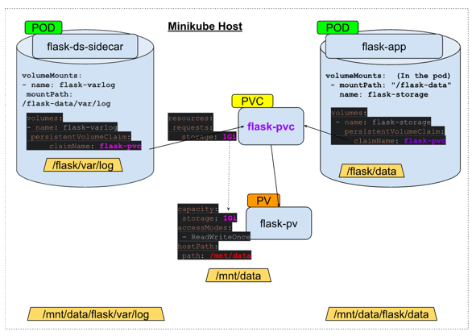


## Build the apps 
1. Build the docker image
```shell
cd flask-application/
# For PRIVATE repo 
docker build -t ${AWS_ID}.dkr.ecr.${region}.amazonaws.com/cloudexperts_yidgar/falsk-app:1.0 .

# or for PUBLIC Repo
docker build -t public.ecr.aws/q2y0f5j6/cloudexperts_yidgar/flask-app:1.0 .
```

2. Push the image
```shell
# PRIVATE 
docker push  ${AWS_ID}.dkr.ecr.${region}.amazonaws.com/cloudexperts_yidgar/falsk-app:1.0

# PUBLIC 
docker push public.ecr.aws/q2y0f5j6/cloudexperts_yidgar/flask-app:1.0
```

3. Create Secret for pulling the image from ECR 
   and Reference this secret in your Kubernetes deployment configuration

`secret name : lesson4-secret`

```shell
k apply -f namespace/task4-namespace.yaml
kubectl create secret docker-registry lesson4-secret \
  --docker-server=${AWS_ID}.dkr.ecr.${region}.amazonaws.com \
  --docker-username=AWS \
  --docker-password=$(aws ecr get-login-password --region ${region}) \
  -n $NS
```
Note :  To (manually) pull an image from ECR , use :
```shell
docker pull ${AWS_ID}.dkr.ecr.${region}.amazonaws.com/{repository}/{image_name}:{TAG}
```

# Creation of all resources
```shell
# configs 
k apply -f namespace/task4-namespace.yaml
k apply -f configuration/flask-config.yaml
k apply -f secrets/flask-secret.yaml

# nginx
k create ns ingress-nginx 
k apply -f https://raw.githubusercontent.com/kubernetes/ingress-nginx/main/deploy/static/provider/cloud/deploy.yaml 

# volumes
k apply -f volumes/flask-pv.yaml
k apply -f volumes/flask-pvc.yaml


# deployments 
k apply -f flask-application/flask-deployment.yaml
# OR at latest task request: 
k apply -f flask-application/flask-statefulset.yaml

k apply -f flask-application/ingress-class.yaml
k apply -f flask-application/flask-ingress.yaml

# Cron
k apply -f ../cron/flask-cron.yaml
```

# Deletion of all resources (at the end)
```shell
# deployments 
k delete -f flask-application/flask-deployment.yaml
# OR at latest task request: 
k delete -f flask-application/flask-statefulset.yaml

k delete -f flask-application/ingress-class.yaml

# Cron
k delete -f ../cron/flask-cron.yaml


## Configs and NS 
k delete -f configuration/flask-config.yaml
k delete -f secrets/flask-secret.yaml
k delete -f namespace/task4-namespace.yaml

# volumes
k delete -f volumes/flask-pv.yaml
k delete -f volumes/flask-pvc.yaml

# nginx
k delete -f flask-application/ingress-class.yaml
k delete -f flask-application/flask-ingress.yaml
k delete ns ingress-nginx 

```

# Check pod and service works with livetest 
```shell
k port-forward pod/flask-app-6c4d799b47-944lz 5000:5000
k port-forward service/flask-service -n $NS 5000:80
```
in both cases , when running below 
```shell
curl localhost:5000/
```
Expected:
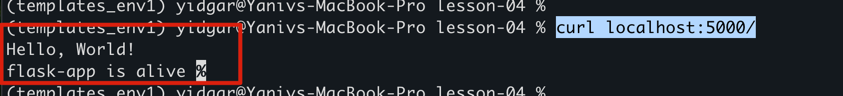


# check the service from minikube 
```shell
minikube service flask-service -n $NS --url
# then run (with the assigned minikube port displayed: 
http://127.0.0.1:52305/ 

# expected 
Hello, World!
flask-app is alive 
```
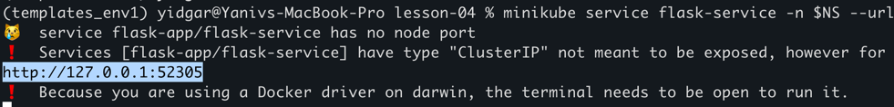

and curl command: 

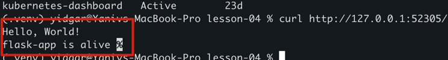


# Check the ingress

## run minikube tunnel to expose it to the ingress and to get ip
```shell
sudo minikube tunnel

# and in another tab :
k get all -n ingress-ngin
```
before running minukube tunnel, there is pending for the External-IP :
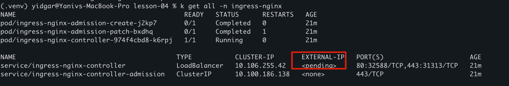

After running minikibe tunnel , External-IP is assigned to the ingress-nginx-controller:
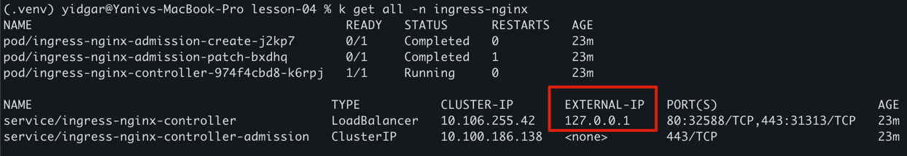

add to local /etc/hosts link flask.local to the minikube tunnel ip  
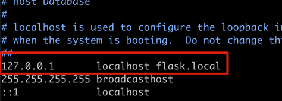


# check the nginx configuration in the nginx controller 
```shell
 k exec -it service/ingress-nginx-controller -n ingress-nginx -- /bin/bash
```


# Verify that the Ingress controller is directing traffic
```shell
curl --resolve "flask.local:80:127.0.0.1" -i http://flask.local
```
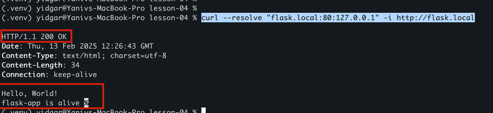

also , check the flask.local via browser : 

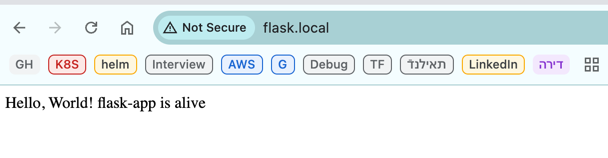

# Check log files in the flask app POD 
```shell
# Login to the pod 
k exec -it flask-app-0 -n  $NS -- /bin/bash

# check log file  
tail -10 /flask-data/var/log/app.log

# run curl command 
curl localhost:5000/

# expect to see line with "Flask app received a request on /" 
```
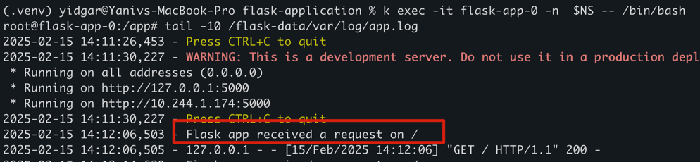


# Verify that log files exists in the DaemonSet POD 

```shell
# login to the flask-daemonset
k exec -it daemonset.apps/flask-daemonset -n $NS -- /bin/sh

# and run below  
tail -5 /flask-data/var/log/var/log/app.log
```
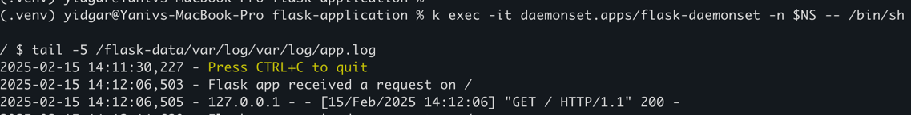


# After flask-cron is applied , check in the flask-daemonset that you get a log entry every 5 minutes
