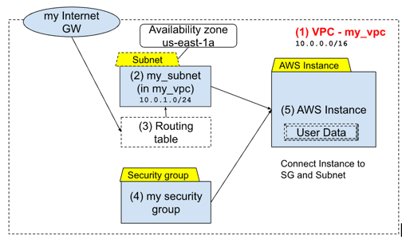

# Exercise Lesson 6


## General Steps
1. Create VPC
2. Create Subnets (in the VPC)
   - Optional
      - Create internet Gayeway 
      - Routing table in the VPC
      - Associate subnet with routing table
4. Create Security Group in the VPC 
   - make sure to add port 22 so you can ssh to it 
5. Create the AWS instance with user data , connect to th VPC and SG 

## Description - Task1 



Define in terraform the following resources:
- Security group with ingress rule allowing communication from anywhere on port 80 named: dokuwiki-sg
  - AWS instance with the following attributes:
    - based on amazon linux AMI
    - t2.micro size
    - The following user data:
```shell
#!/usr/bin/bash
yum install docker -y
systemctl enable docker
systemctl start docker 
docker run -d -p 80:80 --name dokuwiki bitnami/dokuwiki:latest
```
- Add Security groups: default and dokuwiki

expected after apply - the instance public IP


## Description - Task2 
Define the previous EC2 instance as an autoscaling group with 1 instance


