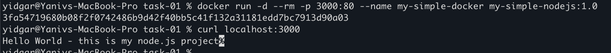

# How to run  

## Build docker using 
docker build -t my-simple-nodejs:1.0 . 

## run the docker image 
docker run -d --rm -p 3000:80 --name my-simple-docker my-simple-nodejs:1.0

## check using
curl localhost:3000

