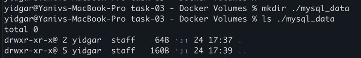
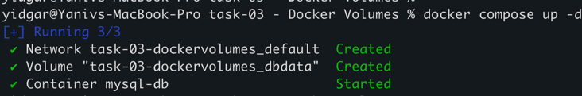
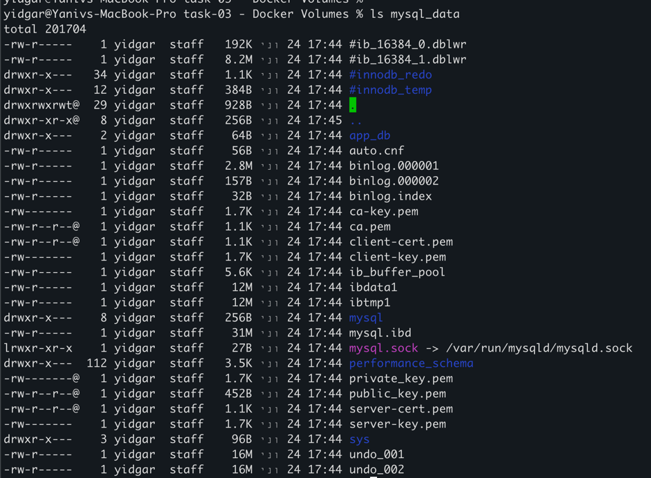

# How to run 

# create volume and inspect it 
docker volume create mydata 
docker volume inspect mydata

# 1. Create local directory for the data 
mkdir ./mysql_data

## 2. Run the docker compose 
docker-compose up -d

## 3. check that the mysql data dir is populated

# to clean , run  
docker-compose down --volumes
