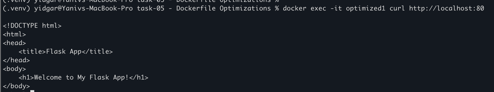
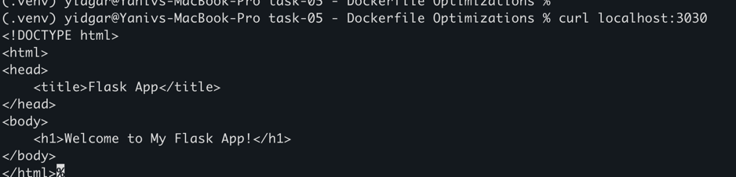

# 1. Build docker image
docker build -t my-optimized-docker:1.0 .

# 2. Run the docker
docker run -d --name optimized1 -p 3030:80 my-optimized-docker:1.0

# 3. Verify that the script works in trhe container 
docker exec -it optimized1 curl http://localhost:80

# 4. check response in localhost:3030 

# to login to the container for debug, use :
docker exec -it optimized /bin/bash

