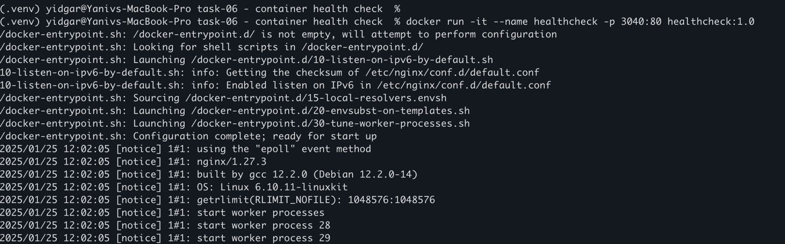
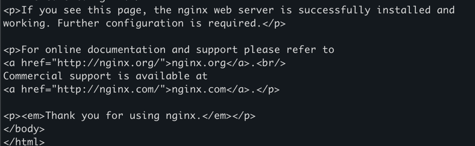
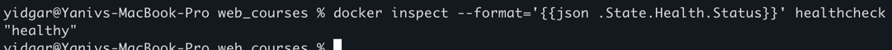

# 1. Build the image
docker build -t healthcheck:1.0 .

# 2. Run the image 
docker run -it -d --name healthcheck -p 3040:80 healthcheck:1.0

 

# 3. check the conntainer 
curl localhost:3040

# and another option - check health using 
 docker inspect --format='{{json .State.Health.Status}}' healthcheck
