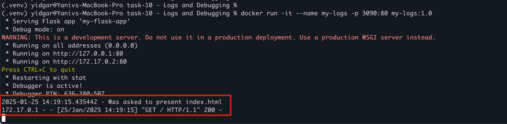

# build the docker image
docker build -t my-logs:1.0 .

# Run the docekr 
docker run -it --name my-logs -p 3090:80 my-logs:1.0

Run curl to localhost:3090 in another tab 

# observe print of log in the main tab
